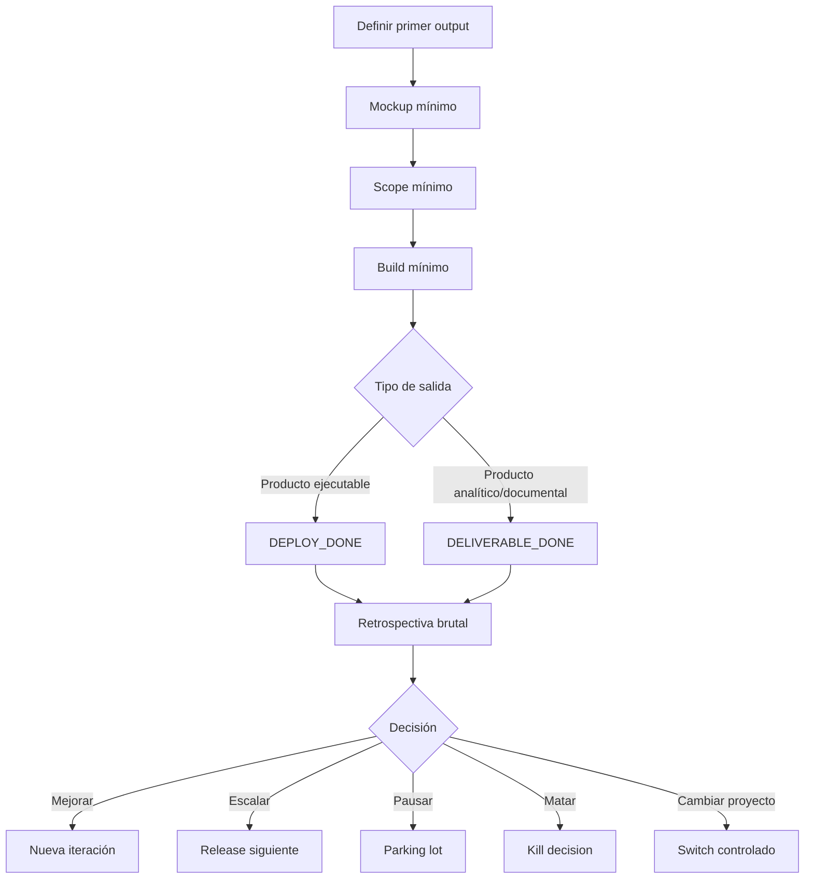

# Constitución de Desarrollo de Proyectos TI con IA

## 00.00 Propósito

Esta constitución define cómo se deben iniciar, enfocar, desarrollar, controlar y cerrar proyectos TI asistidos por IA dentro del ecosistema SkillMachine.

Su finalidad no es producir más documentación. Su finalidad es evitar dispersión, reducir autoengaño operativo y acelerar salidas reales de producto.

Las dos salidas reconocidas son:

- **DEPLOY_DONE**: producto ejecutable/desplegable funcionando.
- **DELIVERABLE_DONE**: entregable analítico, documental u operacional validado.

## 01.00 Principio central

Antes de expandir un proyecto, se debe definir su primer output funcional.

La secuencia obligatoria es:

1. Definir primer output.
2. Definir mockup mínimo.
3. Definir funcionalidades y características mínimas.
4. Definir lo mínimo necesario para cumplir la funcionalidad esperada.
5. Definir inversión máxima: tiempo, costo, esfuerzo y Plan B.
6. Ejecutar hasta `DEPLOY_DONE` o `DELIVERABLE_DONE`, o activar stop-loss.
7. Ejecutar retrospectiva crítica.
8. Decidir: mejorar, escalar, pausar, matar o cambiar de proyecto.

## 02.00 Anti portfolio sprawl

El sistema debe evitar abrir múltiples frentes activos sin conversión a salida real.

Regla:

- Máximo un proyecto en `DEPLOY_TRACK`.
- Máximo un proyecto en `PLATFORM_TRACK`.
- Todo lo demás va a `PARKING_LOT`.

Si entra un proyecto nuevo, otro debe cerrarse, pausarse o bajar de prioridad.

## 03.00 Stop-loss

Todo primer output debe tener límites.

Campos mínimos:

- `MAX_HOURS`
- `MAX_SESSIONS`
- `MAX_COST`
- `MAX_EFFORT`
- `PLAN_B_TRIGGER`
- `PLAN_B_ACTION`

Si se cumple el trigger, no se sigue iterando por inercia. Se activa Plan B.

## 04.00 Tipos de salida

### 04.10 DEPLOY_DONE

Aplica a productos ejecutables o desplegables.

Ejemplos:

- aplicación web;
- dashboard;
- API;
- agente;
- sistema local reproducible;
- prototipo funcional accesible.

Criterios mínimos:

1. Existe versión ejecutable.
2. Corre en entorno local reproducible o hosting mínimo.
3. Tiene ruta funcional de punta a punta.
4. Cumple caso de uso mínimo.
5. Tiene evidencia: URL, screenshot o log.
6. Tiene smoke test.
7. Tiene defectos y mejoras registrados.
8. Tiene horas registradas.
9. Tiene commit, tag o release marker.

### 04.20 DELIVERABLE_DONE

Aplica a productos no necesariamente desplegables.

Ejemplos:

- workbook trazable;
- informe;
- matriz;
- documento técnico;
- auditoría;
- análisis;
- paquete operativo;
- artefacto GRC.

Criterios mínimos:

1. Entregable existe en ruta definida.
2. Tiene objetivo y audiencia explícitos.
3. Cumple criterio mínimo de uso.
4. Tiene evidencia de validación.
5. Tiene backlog/deuda si corresponde.
6. Tiene horas registradas.
7. Tiene commit o marca de versión.

## 05.00 Flujo operativo

## 06.00 Reglas de foco

Antes del primer output funcional queda prohibido:

- crear governance no bloqueante;
- expandir features futuras;
- optimizar arquitectura no crítica;
- perfeccionar estética no crítica;
- investigar herramientas alternativas sin blocker real;
- cambiar stack por preferencia;
- abrir nuevos frentes no relacionados.

Permitido:

- reducir scope;
- resolver blockers reales;
- construir ruta mínima;
- registrar deuda;
- ejecutar pruebas;
- documentar ejecución mínima;
- activar IA dedicada bajo branch y DoD.

## 07.00 Rol de la IA y del humano

### Humano

- decide scope;
- define prioridad;
- aprueba tradeoffs;
- valida output;
- activa Plan B;
- decide merge, pausa, kill o continuidad.

### IA

- propone;
- ejecuta bajo restricciones;
- detecta contradicciones;
- registra deuda;
- enseña de forma subordinada al avance;
- no adula;
- no expande alcance sin justificación.

## 08.00 Pedagogía subordinada

El usuario quiere aprender, pero el aprendizaje no debe bloquear avance.

Regla:

1. Primero avance operacional.
2. Luego explicación breve.
3. Profundidad solo si se solicita o si evita error relevante.

## 09.00 Registro obligatorio

Cada sesión debe registrar:

- backlog;
- deuda técnica;
- mejoras;
- acuerdos;
- aprendizaje;
- criterios;
- metodologías;
- ideas aparcadas;
- definiciones;
- horas invertidas.

El registro debe ser suficiente para continuidad, no una ceremonia.

## 10.00 Retrospectiva brutal

Después de cada `DEPLOY_DONE` o `DELIVERABLE_DONE`:

1. Qué se prometió.
2. Qué se logró.
3. Qué no se logró.
4. Horas reales.
5. Dónde se fue el tiempo.
6. Producto vs governance vs retrabajo.
7. Decisiones malas.
8. Scope sobrante.
9. Qué debió cortarse antes.
10. Deuda aceptada.
11. Aprendizaje.
12. Cambio para el próximo ciclo.
13. Decisión final: continuar, mejorar, pausar, matar o cambiar.

## 11.00 Regla de cierre

Un proyecto TI no entra en expansión hasta tener su primer output funcional.

Todo lo que no acerque `DEPLOY_DONE` o `DELIVERABLE_DONE` va a backlog, no al ciclo actual.
