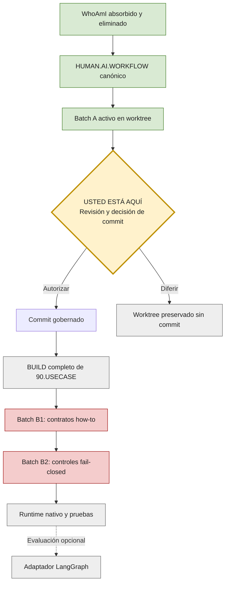
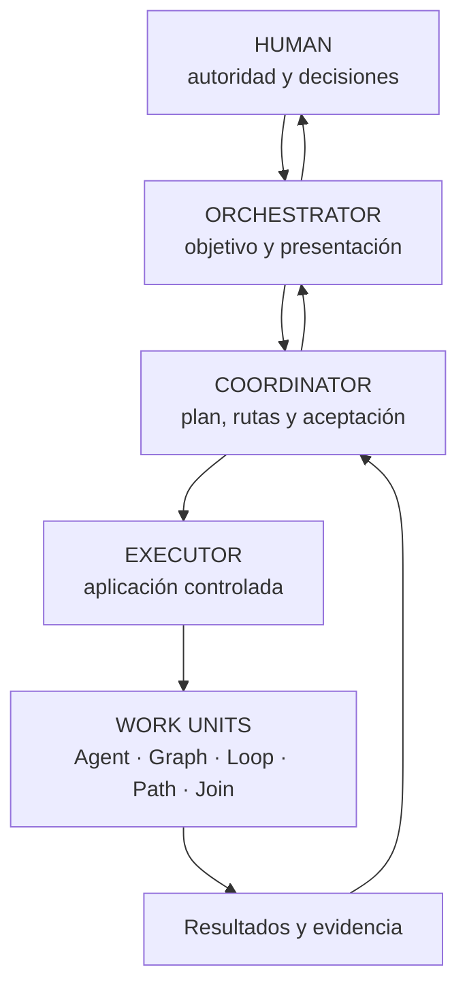
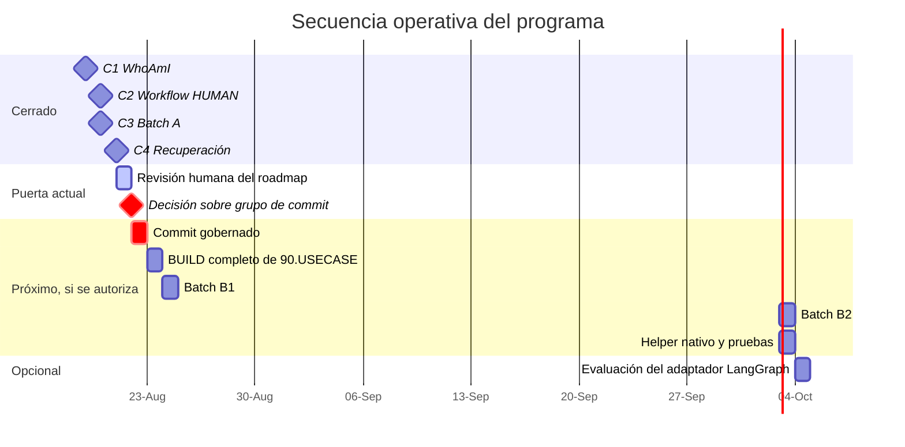
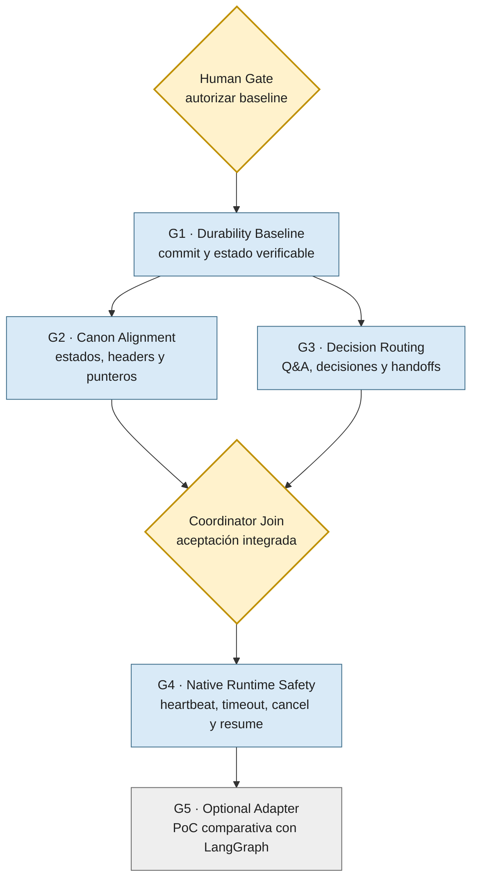
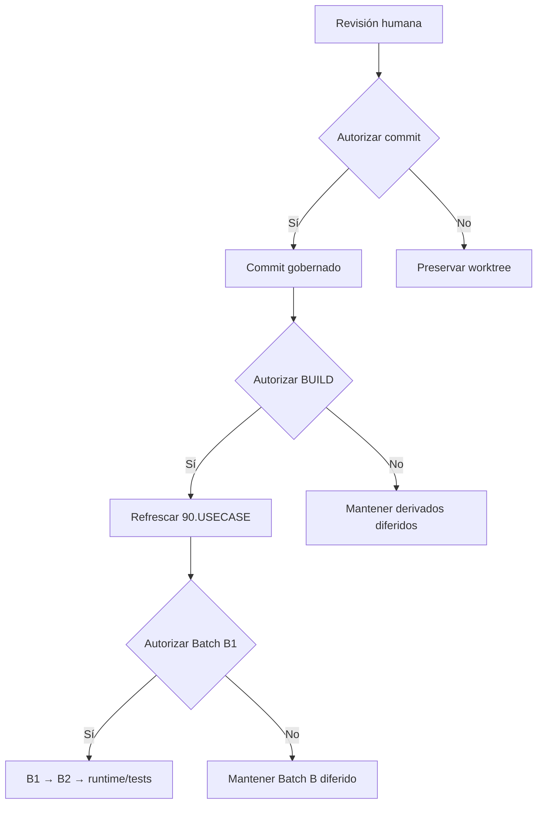

# PS.SkillsMachine — Roadmap activo

> Documento canónico para personas. Explica qué estamos construyendo, dónde estamos, qué existe realmente y qué decisión corresponde tomar después.

| Campo | Estado |
|---|---|
| Ruta canónica | `SyS/PROJECT.ROADMAP.ACTIVE.md` |
| Última verificación | 31 de agosto de 2026 |
| Fase actual | FIRST_DEPLOY_V1 closed; post-deploy reconciliation landed; DSH + OmniRoute runtime bootstrap PASS (0.1.1-rc.2) |
| Rama / HEAD verificado | `main` / `c36e8325338511b2c24fa4b091ca70890bdf9308` |
| Staging, commit y push | Realizados hasta NightShift backlog governance pilot findings |
| Autoridad de identidad y significado | HUMAN |
| Próxima decisión | Nuevo ORCHESTRATOR: iniciar con propuesta read-only de NS-BL-0002; diferir piloto repo externo hasta un paso adicional validado en NightShift |
| Durabilidad Batch A | `COMMITTED` / `PUSHED` (A0/A/C/D/E + POLICY + FIRST_DEPLOY_V1 + IF1..IF5) |

## 1. Resumen ejecutivo

PS.SkillsMachine es el producto gobernado para administrar, distribuir y perfeccionar Skills y GRCs (Governance, Risk and Compliance controls) utilizados en el trabajo entre personas e inteligencia artificial.

### Dónde estamos ahora

- ✅ **WhoAmI fue absorbido por HUMAN y eliminado físicamente.** No quedan dependencias ni punteros activos.
- ✅ **`HUMAN.AI.WORKFLOW` es el dueño conceptual canónico** de la metodología de trabajo humano–IA.
- ✅ **FIRST_DEPLOY_V1 quedó cerrado.** No reabrir readiness salvo nuevo blocker confirmado.
- ✅ **Los cambios post-deploy ya aterrizaron en `main` con commit y push.** Incluyen refresh compilado de `90.USECASE`, closeout de eliminación de fuentes superseded, IF1/IF3/IF4/IF5 y refresh de roadmap.
- ✅ **Integración de EXECUTOR Runtime con DeepSeek Harness (DSH) + OmniRoute completada.** Bootstrap alcanzó estado operativo PASS (DSH 0.1.1-rc.2, OmniRoute en `:20128/v1`, modelo local `Para_DSH` corregido a `maxTokens: 32768`, proxy temporal `:20129` eliminado, browser auto-open centralizado en launcher generic `$HOME/bin/DSH--`). DSH y OmniRoute operan estrictamente como capas de tooling y runtime sin autoridad semántica.
- ✅ **NightShift sigue siendo `LAB_ONLY`**, pero su piloto controlado y backlog findings ya quedaron documentados como evidencia, sin promoción a canon.
- ⛔ **Batch B1 no está autorizado.** La investigación de runtime safety (seguridad en tiempo de ejecución) terminó, pero la implementación no comenzó.
- ⏸️ **LangGraph permanece como adaptador opcional.** No está instalado ni ejecutado y no define la arquitectura canónica.
- ⏸️ **El BUILD completo de `90.USECASE` está diferido.** Solo se sincronizó el RUNBOOK de `SESSION_CLOSE`.

> **Usted está aquí:** preparar un nuevo arranque de ORCHESTRATOR con continuidad post-deploy completa y sin reabrir readiness.

## 2. Mapa del programa



## 3. Autoridad y flujo operativo

La persona conserva la autoridad semántica y decisional. Una recomendación de una IA no equivale a autorización.



### Modelo transitorio autorizado: Option R1

Mientras Coordinator no sea un proceso independiente, una misma sesión puede cambiar de rol, pero debe declarar cada fase:

1. `ROLE_PHASE=COORDINATOR`
2. `ROLE_PHASE=HUMAN_GATE` (puerta de autorización humana)
3. `ROLE_PHASE=EXECUTOR`
4. `ROLE_PHASE=COORDINATOR_ACCEPTANCE`
5. `ORCHESTRATOR_PRESENTATION`
6. HUMAN

El Executor no entrega directamente al Orchestrator. Command Path, Result Path y Apply Path son rutas diferentes.

## 4. Gantt lógico del trabajo

> Este Gantt muestra **orden y dependencias**, no compromisos de calendario. Las duraciones futuras de un día son unidades visuales; deberán reemplazarse por estimaciones aprobadas durante planning (planificación).



Los elementos cerrados se muestran como hitos sin barra para evitar texto de bajo contraste. `C1`–`C4` corresponden, respectivamente, al cierre de WhoAmI, activación de `HUMAN.AI.WORKFLOW`, alineación de Batch A y recuperación de gobernanza.

## 4.1 Cinco Graphs (grafos de trabajo) que podemos desarrollar

Estos son **candidatos de desarrollo**, no capacidades ya implementadas ni autorizaciones implícitas.



| Graph | Objetivo | Gate de entrada | Entregable verificable |
|---|---|---|---|
| **G1 — Durability Baseline** | Convertir el estado aprobado del worktree en una baseline (línea base) durable. | Autorización humana del grupo exacto de commit. | Commit delimitado, validado y trazable; push solo si se autoriza aparte. |
| **G2 — Canon Alignment** | Resolver drift (desalineación) de estados, headers y punteros activos. | G1 aceptado o allowlist independiente expresamente autorizada. | `HUMAN.AI.WORKFLOW`, Skill 02, GRC secuencial y referencias con estados coherentes. |
| **G3 — Decision Routing** | Hacer durables Questions and Answers, decisiones, Command/Result/Apply Paths y handoffs. | Dueños canónicos y formato de registro aprobados. | Contrato operativo y pruebas que impidan el salto Executor → Orchestrator. |
| **G4 — Native Runtime Safety** | Implementar primero la seguridad nativa y framework-neutral. | Batch B1 y B2 autorizados; G2/G3 aceptados. | Heartbeat, timeout, cancellation, checkpoint/resume, recovery y pruebas adversariales. |
| **G5 — Optional Adapter** | Determinar si LangGraph aporta valor sin convertirse en canon obligatorio. | G4 estable y criterios de comparación aprobados. | PoC (Proof of Concept / prueba de concepto), benchmark y decisión adopt/reject/defer. |

### Reglas de ejecución de los cinco grafos

- G2 y G3 pueden avanzar en paralelo **solo** si sus allowlists (listas exactas de archivos autorizados) no se superponen.
- Si ambos necesitan modificar el mismo archivo, el Coordinator debe serializar el Apply Path.
- G4 no debe comenzar antes de aprobar B1/B2; tener un diagrama no equivale a tener runtime.
- G5 es deliberadamente el último. Evaluar LangGraph antes del runtime nativo contaminaría la arquitectura con decisiones del proveedor.
- Cada Graph debe producir alternativas, resultados negativos con causa, evidencia y una recomendación. El Coordinator selecciona; el Human autoriza cuando corresponda.

## 5. Workstreams (líneas de trabajo)

| ID | Línea de trabajo | Estado | Resultado o brecha principal |
|---|---|---:|---|
| WS01 | HUMAN e identidad | ✅ Completado | WhoAmI absorbido y eliminado; HUMAN es la única autoridad de identidad. |
| WS02 | Alineación Skills/GRCs | 🟡 Activo | Batch A activo en worktree, sin commit ni push. |
| WS03 | Roles y routing (enrutamiento) | 🟡 Activo | Option R1 registrada y utilizada. |
| WS04 | Runtime de Graph, Loop y Path | 🟠 Parcial | How-to activo; runtime de producto aún no conectado. |
| WS05 | Runtime safety | 🟠 Parcial | Investigación terminada; B1 no autorizado. |
| WS06 | Preguntas, respuestas y decisiones | 🟠 Parcial | Existen dueños; aún hay decisiones que dependen de chat/TEMP. |
| WS07 | Compilación y derivados | 🟠 Parcial | RUNBOOK de `SESSION_CLOSE` sincronizado; BUILD completo diferido. |
| WS08 | Validación y regresión | 🟡 Activo | Gates disponibles; dirty worktree produce un warning esperado. |
| WS09 | Alineación de estados | 🟡 Activo | Roadmap, backlog y registro de cerrados reconciliados. |
| WS10 | Adaptadores de frameworks | ⏸️ Diferido | LangGraph no instalado ni ejecutado. |

## 6. Milestones (hitos)

| ID | Hito | Estado | Durabilidad | Decisión humana pendiente |
|---|---|---:|---|---:|
| MS-WHOAMI-ABSORB | Contenido útil de WhoAmI absorbido por HUMAN | ✅ Completado | Registrado (MB-SM-077D) | No |
| MS-WHOAMI-DELETE | Residuos físicos de WhoAmI eliminados | ✅ Completado | Worktree sin commit | Commit posterior |
| MS-HUMAN-AI-WORKFLOW | `HUMAN.AI.WORKFLOW` creado y activado | ✅ Completado | Worktree sin commit | Commit posterior |
| MS-BATCH-A-DESIGN | Diseño de Batch A | ✅ Completado | Aplicado | No |
| MS-BATCH-A-ACTIVATION | Activación de Batch A | 🟡 Activo | `ACTIVE_IN_WORKTREE_UNCOMMITTED` | Sí |
| MS-BATCH-B-RESEARCH | Investigación de Batch B | ✅ Completado | Evidencia disponible | No |
| MS-BATCH-B-COMPLETION-GATE | Cierre de implementación Batch B | ⛔ Bloqueado | Depende de B1 | Sí |
| MS-BATCH-B1 | Batch B1: contratos how-to | ⛔ Bloqueado / PLANNED | No iniciado; `AUTHORIZATION=NO` | Sí, autorizar o diferir |
| MS-BATCH-B2 | Batch B2: timeout/cancel fail-closed | ⏸️ Planificado | Depende de B1 | Después de B1 |
| MS-BATCH-B3B4 | Helper nativo y pruebas | ⏸️ Diferido | No iniciado | Posterior |
| MS-GENERATED-REFRESH | BUILD completo de `90.USECASE` | ⏸️ Diferido | No autorizado | Sí |
| MS-LANGGRAPH | Adaptador LangGraph | ⏸️ Opcional | No instalado ni ejecutado | No ahora |
| MS-STATUS-ALIGNMENT | Alineación roadmap/backlog/cerrados | 🟡 Activo | Este archivo | No ahora |
| MS-NEXT-HUMAN-GATE | Siguiente puerta humana | 🟡 Activo | Commit/push no autorizados | Sí |

## 7. Realidad de implementación

Esta tabla evita confundir intención, instrucciones y software funcionando.

| Capacidad | Concepto | Skill / GRC | Tool y tests | Runtime real | Próximo paso |
|---|---|---|---|---|---|
| Arquitectura de roles | Canónica | How-to y HARD_STOP activos | Runtime y tests de roles ausentes | Solo fases de sesión con R1 | Usar R1; automatización diferida |
| Work Units tipadas | Dirección canónica | Contrato e aislamiento activos | Soporte parcial en HybridGraphExec | No conectado a todo el producto | Diferido |
| Ciclo de vida de Graph | Dirección canónica | How-to y controles de no promoción activos | Pruebas parciales de herramienta | No conectado al runtime del producto | B1, aún no autorizado |
| Alternativas Path | Dirección canónica | How-to y control de autorización activos | Sin runtime ni test dedicado | No implementado | Diferido |
| Loop: tres fallas equivalentes | Canónico | How-to y HARD_STOP activos | Sin prueba dedicada conocida | Procedimiento activo | Mantener |
| Heartbeat, timeout y cancellation | Intención candidata | Solo placeholders; sin HARD_STOP completo | Fixture de laboratorio | No implementado | Batch B1/B2 |
| Coordinator no disponible | Dirección canónica | Fail-closed activo | Sin canal de recuperación | Doctrina, no runtime | Batch B2 |
| Command / Result / Apply Path | Canónico | How-to y HARD_STOP activos | Sin runtime de rutas | Fases de sesión | Usar Option R1 |
| Durabilidad de decisiones | Intención canónica | Dueños y regla “recommendation ≠ authorization” | Registros manuales | Parcial | Escribir en HUMAN/roadmap/backlog/closed register |
| Identidad WhoAmI | Retirada | Skill eliminado | Residuos eliminados | Sin loader | No recrear |
| LangGraph | Adaptador opcional | Framework no obligatorio | No instalado ni probado | Ausente | Evaluar solo después del runtime nativo |

## 8. Dependencias principales



## 9. Riesgos y bloqueos vigentes

| Prioridad | Riesgo o bloqueo | Consecuencia | Tratamiento recomendado |
|---|---|---|---|
| Alta | Cambios activos sin commit/push | El estado existe solo en el worktree | Revisar y autorizar un grupo de commit explícito. |
| Alta | Prompts antiguos envían Executor → Orchestrator | Contradicen Option R1 | Actualizar routing (enrutamiento) en un lote controlado. |
| Media | `HUMAN.AI.WORKFLOW` conserva etiquetas `CANDIDATE` | El texto conceptual no refleja por completo Batch A | Ejecutar limpieza B7. |
| Media | Skill 02 y GRC secuencial conservan headers `DRAFT` | Estado documental contradictorio | Alinear nombres/headers en un lote separado. |
| Media | Paquetes compilados anteriores a Batch A | Los derivados no representan todo el canon vigente | Autorizar y ejecutar BUILD completo. |

## 10. Decisiones que debe tomar HUMAN

En este orden:

1. **Aceptar o pedir correcciones a este roadmap humano.**
2. **Autorizar o diferir el grupo de commit** de la recuperación, `HUMAN.AI.WORKFLOW` y Batch A.
3. **Autorizar o diferir el BUILD completo** de `90.USECASE`.
4. **Autorizar o diferir Batch B1.**

No se solicita ahora instalar LangGraph. WhoAmI ya está cerrado. Option R1 ya está autorizada.

## 11. Definición de estados

| Estado | Significado |
|---|---|
| ✅ Completado | Trabajo aplicado y validado; la columna de durabilidad indica si ya existe commit. |
| 🟡 Activo | Trabajo vigente que requiere seguimiento o una decisión. |
| 🟠 Parcial | Existe doctrina, herramienta o prueba, pero no la capacidad completa. |
| ⛔ Bloqueado | No puede continuar sin una dependencia o autorización. |
| ⏸️ Diferido | Decisión consciente de no ejecutarlo todavía. |

## 12. Fuentes canónicas y operativas

| Propósito | Archivo |
|---|---|
| Roadmap canónico (este archivo) | `SyS/PROJECT.ROADMAP.ACTIVE.md` |
| Canon HUMAN | `HUMAN/HUMAN.README.txt` |
| Modelo operativo | `HUMAN/HUMAN.OPERATING.MODEL.txt` |
| Metodología humano–IA | `HUMAN/HUMAN.AI.WORKFLOW.txt` |
| Política de ejecución | `SkillsLake/01.SKILLS/02.SKILL.AGENT_EXECUTION_POLICY.txt` |
| GRC secuencial | `GRCLake/01.CONTROLS/GRC.AI_CODE_AGENT_SEQUENTIAL_WORKFLOW.txt` |
| Trabajo ejecutable | `SyS/PROJECT.BACKLOG.ACTIVE.txt` |
| Cerrados y supersedidos | `SyS/CLOSED.SUPERSEDED.REGISTER.txt` |
| Deuda técnica | `SyS/TECHNICAL.DEBT.ACTIVE.txt` |
| Herramienta de grafos | `SyS/A_Tools/HybridGraphExec/v0.1` |
| Readiness de cierre | `SyS/A_Tools/SessionClose/Test-SessionCloseReadiness.ps1` |
| RUNBOOK fuente | `SyS/A_Tools/UseCaseSources/02.SessionClose/RUNBOOK.SESSION_CLOSE.HARDENED.txt` |
| RUNBOOK derivado | `90.USECASE/02.SESSION_CLOSE/RUNBOOK.SESSION_CLOSE.HARDENED.txt` |

## 13. Registro técnico mínimo

```text
SCHEMA_VERSION=2.0-HUMAN-MARKDOWN
PROJECT=PS.SkillsMachine
CREATED_AT=2026-07-17 23:03:49 -04:00
UPDATED_AT=2026-09-01
SOURCE_DECISION=MB-SM-066A_RECONCILE_PRODUCT_BACKLOG_TECH_DEBT_AND_ROADMAP
AUTHORITATIVE_FOR=PRODUCT_EXECUTION_PATH
ROADMAP_IS_CANONICAL=YES
ROADMAP_PATH=SyS\PROJECT.ROADMAP.ACTIVE.md
LEGACY_TXT_SUPERSEDED=SyS\PROJECT.ROADMAP.ACTIVE.txt
BACKLOG=SyS\PROJECT.BACKLOG.ACTIVE.txt
CLOSED_REGISTER=SyS\CLOSED.SUPERSEDED.REGISTER.txt
DOES_NOT_DUPLICATE_FULL_BACKLOG=YES
SOURCE_TXT_SHA256=6fb9bcf0814a7137d936dae5c091576def2365965b47ee4c3f480f87550c7147
PHASE=POST_FIRST_DEPLOY_DSH_RUNTIME_RECONCILED
BATCH_A_ALIGNMENT_STATE=ACTIVE
BATCH_A_DURABILITY_STATE=COMMITTED_AND_PUSHED
BATCH_A_COMMITTED=YES
BATCH_A_PUSHED=YES
BATCH_B_RESEARCH=COMPLETED
BATCH_B_COMPLETION_GATE=NOT_PASSED
BATCH_B1_AUTHORIZATION=NO
LANGGRAPH=OPTIONAL_ADAPTER_NOT_INSTALLED_NOT_EXECUTED
WHOAMI_PHYSICAL_RESIDUAL_STATE=DELETED
WHOAMI_CLOSEOUT_STATE=COMPLETED
WHOAMI_ACTIVE_DEPENDENCIES=0
HUMAN_SOLE_IDENTITY_AUTHORITY=YES
OPTION_R1=AUTHORIZED
EXECUTOR_RUNTIME=DEEPSEEK_HARNESS
DSH_VERSION=0.1.1-rc.2
OMNIROUTE_BASEURL=http://127.0.0.1:20128/v1
PARA_DSH_MAXTOKENS=32768
FULL_90_USECASE_BUILD=NO
LAST_VERIFIED=2026-09-01
HEAD_AT_VERIFY=c36e8325338511b2c24fa4b091ca70890bdf9308
BRANCH=main
STAGING=NO
COMMIT=NO
PUSH=NO
MIGRATION_TASK_ID=20260821.112000_SM_ROADMAP_MARKDOWN_CANONICAL_MIGRATION_GRAPH_001
TASK_ID=20260821.084729_SM_AI_WORKFLOW_GOVERNANCE_RECOVERY_ROADMAP_WHOAMI_AND_RUNTIME_ALIGNMENT_001
REVISION_TASK_ID=20260821.090511_SM_G55_ALLOWLIST_REVISION_AND_SECOND_GATE_001
```

## 14. Próxima acción única

**Nuevo ORCHESTRATOR toma esta superficie como cold-start y comienza por el board post-deploy; recomendación: NS-BL-0002 como propuesta read-only.**

No ejecutar por inferencia: HUMAN mutations, promoción de candidatos, promoción de NightShift, instalación de LangGraph ni BUILD adicional de `90.USECASE`.

## 15. Apéndice técnico preservado del `.txt`

Las secciones humanas 1–14 son la superficie de lectura. Este apéndice conserva identificadores, dueños de evidencia, hitos históricos y gates de producto que el Markdown comprimía. No sustituye el backlog.

### 15.1 Product intent (máquina)

HUMAN remains the sole identity and semantic authority. Skills own reusable how-to. GRCs own mandatory controls and HARD_STOP conditions. Tools implement runtime capability. Tests prove behaviour. A prompt, candidate, diagram, or Gantt is not runtime implementation.

### 15.2 Implementation-reality matrix (campos completos)

CAPABILITY=Role architecture HUMAN→ORCHESTRATOR→COORDINATOR→EXECUTOR→WORK_UNITS
CONCEPTUAL_STATE=CANONICAL
SKILL_STATE=ACTIVE_HOW_TO_IN_SKILL_02_SECTION_13
GRC_STATE=ACTIVE_HARD_STOPS_IN_SEQUENTIAL_GRC_13
TOOL_STATE=ABSENT_ROLE_RUNTIME
TEST_STATE=ABSENT_ROLE_PHASE_TESTS
RUNTIME_STATE=SESSION_PHASE_ONLY_OPTION_R1
DURABILITY_STATE=ACTIVE_IN_WORKTREE_UNCOMMITTED
NEXT_BATCH=Use R1 now; Coordinator runtime deferred
EVIDENCE_OWNER=HUMAN\HUMAN.AI.WORKFLOW.txt;SkillsLake\01.SKILLS\02.SKILL.AGENT_EXECUTION_POLICY.txt;GRCLake\01.CONTROLS\GRC.AI_CODE_AGENT_SEQUENTIAL_WORKFLOW.txt

CAPABILITY=Work Unit typed objects
CONCEPTUAL_STATE=CANONICAL_DIRECTION
SKILL_STATE=ACTIVE_HOW_TO_AND_CONTRACT_IN_SKILL_02
GRC_STATE=ACTIVE_ISOLATION_AND_AUTHORITY_CONTROLS
TOOL_STATE=PARTIAL_TOOL_LOCAL_CAPABILITY
TEST_STATE=PARTIAL_HYBRID_GRAPH_EXEC_ONLY
RUNTIME_STATE=NOT_PRODUCT_WIDE_RUNTIME_WIRED
DURABILITY_STATE=ACTIVE_IN_WORKTREE_UNCOMMITTED
NEXT_BATCH=DEFERRED
EVIDENCE_OWNER=SkillsLake\01.SKILLS\02.SKILL.AGENT_EXECUTION_POLICY.txt;GRCLake\01.CONTROLS\GRC.AI_CODE_AGENT_SEQUENTIAL_WORKFLOW.txt;SyS\A_Tools\HybridGraphExec\v0.1

CAPABILITY=Graph lifecycle
CONCEPTUAL_STATE=CANONICAL_DIRECTION
SKILL_STATE=ACTIVE_HOW_TO_IN_SKILL_02
GRC_STATE=ACTIVE_GRAPH_NON_PROMOTION_AND_APPLY_PATH_HARD_STOPS
TOOL_STATE=HYBRID_GRAPH_EXEC_V0_1_PRESENT_NOT_SSOT
TEST_STATE=PARTIAL_TOOL_LEVEL_TESTS
RUNTIME_STATE=NOT_PRODUCT_WIDE_RUNTIME_WIRED
DURABILITY_STATE=ACTIVE_IN_WORKTREE_UNCOMMITTED
PLACEHOLDERS_APPLY_ONLY_TO=TIME_BUDGET_FIELD;CANCEL_HOOK_FIELD;DEFERRED_RUNTIME_CAPABILITIES
NEXT_BATCH=B1 not authorized
EVIDENCE_OWNER=SkillsLake\01.SKILLS\02.SKILL.AGENT_EXECUTION_POLICY.txt;GRCLake\01.CONTROLS\GRC.AI_CODE_AGENT_SEQUENTIAL_WORKFLOW.txt;SyS\A_Tools\HybridGraphExec\v0.1

CAPABILITY=Path alternatives
CONCEPTUAL_STATE=CANONICAL_DIRECTION
SKILL_STATE=ACTIVE_HOW_TO_IN_SKILL_02_SECTION_13.80
GRC_STATE=ACTIVE_NON_PROMOTION_AND_AUTHORIZATION_CONTROL
TOOL_STATE=ABSENT_AS_PRODUCT_RUNTIME
TEST_STATE=ABSENT_DEDICATED_TEST
RUNTIME_STATE=NOT_RUNTIME_WIRED
DURABILITY_STATE=ACTIVE_IN_WORKTREE_UNCOMMITTED
NEXT_BATCH=DEFERRED
EVIDENCE_OWNER=SkillsLake\01.SKILLS\02.SKILL.AGENT_EXECUTION_POLICY.txt;GRCLake\01.CONTROLS\GRC.AI_CODE_AGENT_SEQUENTIAL_WORKFLOW.txt

CAPABILITY=Loop (three equivalent failures)
CONCEPTUAL_STATE=CANONICAL
SKILL_STATE=ACTIVE_HOW_TO
GRC_STATE=ACTIVE_HARD_STOP
TOOL_STATE=N/A
TEST_STATE=UNKNOWN_DEDICATED_TEST
RUNTIME_STATE=PROCEDURAL_ACTIVE
DURABILITY_STATE=COMMITTED_GRC_PLUS_BATCH_A_WORKTREE
NEXT_BATCH=None this recovery
EVIDENCE_OWNER=GRCLake\01.CONTROLS\GRC.AI_CODE_AGENT_SEQUENTIAL_WORKFLOW.txt;SkillsLake\01.SKILLS\08.SKILL.PROBLEM_TROUBLE_INCIDENTS.txt

CAPABILITY=Heartbeat / timeout / cancellation
CONCEPTUAL_STATE=CANDIDATE_INTENT
SKILL_STATE=PLACEHOLDER_FIELDS_ONLY
GRC_STATE=NO_TIMEOUT_CANCEL_HARD_STOP
TOOL_STATE=ABSENT_PRODUCT_HELPER
TEST_STATE=LAB_FIXTURE_ONLY
RUNTIME_STATE=NOT_RUNTIME_WIRED
DURABILITY_STATE=N/A
NEXT_BATCH=B1 NOT authorized
EVIDENCE_OWNER=HUMAN\HUMAN.AI.WORKFLOW.txt;SyS\TECHNICAL.DEBT.ACTIVE.txt (TD-007);SkillsLake\01.SKILLS\02.SKILL.AGENT_EXECUTION_POLICY.txt

CAPABILITY=Coordinator unavailable
CONCEPTUAL_STATE=CANONICAL_DIRECTION
SKILL_STATE=ACTIVE_HOW_TO
GRC_STATE=FAIL_CLOSED_ACTIVE_HARD_STOP
TOOL_STATE=ABSENT_RECOVERY_CHANNEL
TEST_STATE=ABSENT
RUNTIME_STATE=DOCTRINE_FAIL_CLOSED
DURABILITY_STATE=ACTIVE_IN_WORKTREE_UNCOMMITTED
NEXT_BATCH=B2 later
EVIDENCE_OWNER=GRCLake\01.CONTROLS\GRC.AI_CODE_AGENT_SEQUENTIAL_WORKFLOW.txt

CAPABILITY=Command / Result / Apply Path
CONCEPTUAL_STATE=CANONICAL
SKILL_STATE=ACTIVE_HOW_TO
GRC_STATE=ACTIVE_HARD_STOPS
TOOL_STATE=ABSENT_PATH_RUNTIME
TEST_STATE=ABSENT
RUNTIME_STATE=SESSION_PHASE_ONLY
DURABILITY_STATE=ACTIVE_IN_WORKTREE_UNCOMMITTED
NEXT_BATCH=Operational prompts must use OPTION_R1
EVIDENCE_OWNER=SkillsLake\01.SKILLS\02.SKILL.AGENT_EXECUTION_POLICY.txt;GRCLake\01.CONTROLS\GRC.AI_CODE_AGENT_SEQUENTIAL_WORKFLOW.txt

CAPABILITY=Decision durability
CONCEPTUAL_STATE=CANONICAL_INTENT
SKILL_STATE=SKILL_22_LIFECYCLE
GRC_STATE=RECOMMENDATION_IS_NOT_AUTHORIZATION
TOOL_STATE=REGISTERS_ONLY
TEST_STATE=ABSENT
RUNTIME_STATE=MANUAL
DURABILITY_STATE=OWNERS_EXIST
NEXT_BATCH=Write material decisions into HUMAN / roadmap / backlog / closed register
EVIDENCE_OWNER=HUMAN\HUMAN.OPERATING.MODEL.txt;SyS\PROJECT.ROADMAP.ACTIVE.md;SyS\PROJECT.BACKLOG.ACTIVE.txt;SyS\CLOSED.SUPERSEDED.REGISTER.txt

CAPABILITY=WhoAmI identity
CONCEPTUAL_STATE=RETIRED
SKILL_STATE=SKILL_23_DELETED
GRC_STATE=N/A
TOOL_STATE=RESIDUALS_DELETED
TEST_STATE=READINESS_NEVER_FAILS_ON_WHOAMI
RUNTIME_STATE=NO_LOADER
DURABILITY_STATE=CLOSEOUT_COMPLETED
NEXT_BATCH=None. Do not recreate.
EVIDENCE_OWNER=HUMAN\HUMAN.OPERATING.MODEL.txt;HUMAN\HUMAN.README.txt;SyS\CLOSED.SUPERSEDED.REGISTER.txt

CAPABILITY=LangGraph
CONCEPTUAL_STATE=OPTIONAL_ADAPTER
SKILL_STATE=N/A
GRC_STATE=FRAMEWORK_NOT_MANDATORY
TOOL_STATE=NOT_INSTALLED
TEST_STATE=NOT_EXECUTED
RUNTIME_STATE=ABSENT
DURABILITY_STATE=N/A
NEXT_BATCH=DEFERRED
EVIDENCE_OWNER=HUMAN\HUMAN.AI.WORKFLOW.txt

Section 4.1 five graphs remain **development candidates**, not product runtime.

### 15.3 Historical product-updater path (preserved, not current phase)

STEP_01=MB-SM-066B_APPLY_BACKLOG_DEBT_ROADMAP_NORMALIZATION  STATE=COMPLETED
STEP_02=MB-SM-067A_UPDATER_HUMAN_RUNBOOK_AND_OPERATOR_UX     STATE=SUPERSEDED_AS_CURRENT_FOCUS; remains planned product work (BL-PROD-003)
STEP_03..10=PLANNED product-updater / demo / beta sequence   STATE=PLANNED (not cancelled)
STEP_11=MB-SM-070A_HEARTBEAT_AND_EXECUTION_BUDGET            STATE=BACKLOG (TD-007; Batch B)
STEP_12=MB-SM-070B_EVIDENCE_RETENTION                        STATE=BACKLOG
STEP_13=MB-SM-070C_TRUSTED_RELEASE_PROVENANCE                STATE=BACKLOG

MB-SM-073B dirty-worktree reconcile: still OPEN as commit-group disposition; 073A two-file description is stale.
MB-SM-075A/075B vertical slice: local/lab complete; COMMIT/PUSH require Human authorization.

Release gates (updater path, still valid for that path):
GATE_01=Real project selected with explicit safety contract.
GATE_02=Dry-run fingerprint reviewed and approved by human.
GATE_03=Apply visible, reversible and validated.
GATE_04=Recovery and rollback behavior documented for operator.
GATE_05=Management demo understandable in 5-10 minutes.
GATE_06=Trusted package provenance decision recorded.
GATE_07=Beta readiness decision explicit and evidence-backed.

PRODUCT_UPDATER_PATH=NOT_THE_CURRENT_FOCUS

### 15.4 Evidence pointers

HUMAN canon: HUMAN\HUMAN.README.txt ; HUMAN\HUMAN.OPERATING.MODEL.txt ; HUMAN\HUMAN.AI.WORKFLOW.txt
Skill 02: SkillsLake\01.SKILLS\02.SKILL.AGENT_EXECUTION_POLICY.txt
Sequential GRC: GRCLake\01.CONTROLS\GRC.AI_CODE_AGENT_SEQUENTIAL_WORKFLOW.txt
Backlog: SyS\PROJECT.BACKLOG.ACTIVE.txt
Closed register: SyS\CLOSED.SUPERSEDED.REGISTER.txt
Technical debt: SyS\TECHNICAL.DEBT.ACTIVE.txt
HybridGraphExec tool: SyS\A_Tools\HybridGraphExec\v0.1
SessionClose readiness: SyS\A_Tools\SessionClose\Test-SessionCloseReadiness.ps1
SESSION_CLOSE RUNBOOK source: SyS\A_Tools\UseCaseSources\02.SessionClose\RUNBOOK.SESSION_CLOSE.HARDENED.txt
SESSION_CLOSE RUNBOOK derived: 90.USECASE\02.SESSION_CLOSE\RUNBOOK.SESSION_CLOSE.HARDENED.txt

### 15.5 Non-canonical execution evidence (not required to understand current state)

TASK_ID=20260821.084729_SM_AI_WORKFLOW_GOVERNANCE_RECOVERY_ROADMAP_WHOAMI_AND_RUNTIME_ALIGNMENT_001
REVISION_TASK_ID=20260821.090511_SM_G55_ALLOWLIST_REVISION_AND_SECOND_GATE_001
MIGRATION_TASK_ID=20260821.112000_SM_ROADMAP_MARKDOWN_CANONICAL_MIGRATION_GRAPH_001
NON_CANONICAL_TEMP_EVIDENCE=YES
NOT_REQUIRED_TO_UNDERSTAND_CURRENT_STATE=YES
SINGLE_NEXT_ACTION=HUMAN_REVIEW_OF_GOVERNANCE_RECOVERY_EVIDENCE_THEN_SEPARATE_COMMIT_GROUP_DECISION
